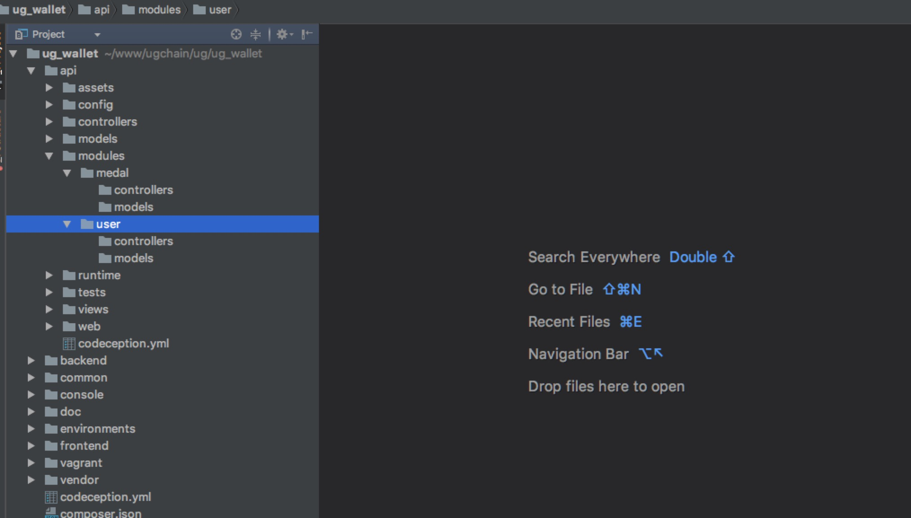
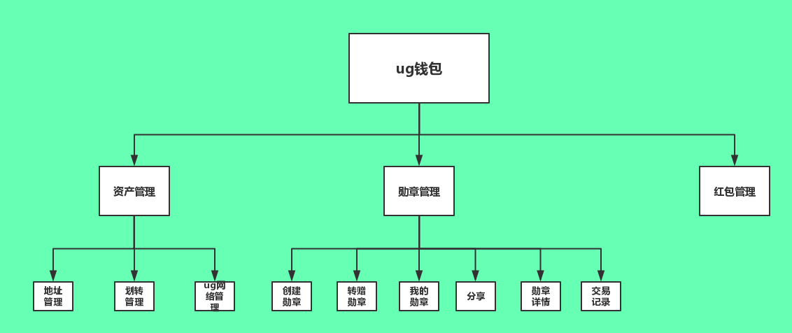

## ug钱包后端详细设计
###目录设计

--

###项目流程图

--

###接口请求方式
 post请求
 
 --
 
###接口加密规则
【验签操作】
步骤1：将各子包体中的各字段进行非空json化。
步骤2：生成随机16位AES加密密钥aesKey。
步骤2：对子包体的json字符串进行AES加密形成各参数的内容。其中加密密钥是aesKey。
步骤3：将除sign,file,param,rsa及以下划线开头的所有参数，按参数名字母顺序排序，拼接成字符串Str1。
步骤4：将aesKey+uri+?+Str1进行Md5，生成sign的值。
【注意事项】
1．请保证请求过程为自然排序（a-z）。
2．参数值含特殊符号时不需进行URLEncode。
3．Sign,rsa参数不参与验签
4．所有参数名首字母均采用小写（由于word软件的原因，部分参数名的第一个字母会变成大写，请忽略）
5．Android使用的AES/ECB/PKCS5Padding，iOS使用的AES/CBC/PKCS5Padding
【请求规则】
1. 接口采用HTTPS协议，以POST方式提交。
2. 返回字符串采用JSON格式。

--

###数据库表结构设计
####中心服务
#####监听表
    DROP TABLE IF EXISTS `center_bridge`;
    CREATE TABLE `center_bridge` (
      `id` int(11) unsigned NOT NULL AUTO_INCREMENT COMMENT '自增ID',
      `app_txid` varchar(50) NOT NULL DEFAULT '' COMMENT 'apptxid',
      `chain_txid` varchar(32) NOT NULL COMMENT '链上txid',
      `address` varchar(32) NOT NULL COMMENT '地址',
      `amount` varchar(32) NOT NULL COMMENT '价格',
      `type` tinyint(1) NOT NULL DEFAULT '1' COMMENT '1:eth_ug 2:ug_eth',
      `owner_txid` varchar(32) NOT NULL COMMENT '执行者txid',
      `status` tinyint(1) NOT NULL DEFAULT '0' COMMENT '0:待确认,1:块上成功,2:块上失败,3:发送给ug成功,4:发送ug失败,5:监听owner确认成功,6:监听owner失败',
      `addtime` int(11) NOT NULL COMMENT '添加时间',
      PRIMARY KEY (`id`)
    ) ENGINE=InnoDB DEFAULT CHARSET=utf8 COMMENT='center_bridge';

--
   
####数据资产管理
#####钱包表
    DROP TABLE IF EXISTS `address`;
    CREATE TABLE `address` (
      `id` int(11) unsigned NOT NULL AUTO_INCREMENT COMMENT '自增ID',
      `nickname` varchar(50) NOT NULL DEFAULT '' COMMENT '钱包名称',
      `address` varchar(32) NOT NULL COMMENT '钱包地址',
      `is_del` tinyint(4) NOT NULL DEFAULT '0' COMMENT '0:未删除1:已删除',
      `addtime` int(11) NOT NULL COMMENT '添加时间',
      PRIMARY KEY (`id`)
    ) ENGINE=InnoDB DEFAULT CHARSET=utf8 COMMENT='钱包表';

--

####阿瓦隆勋章
#####勋章表
    DROP TABLE IF EXISTS `ug_medal`;
    CREATE TABLE `ug_medal` (
      `id` int(11) unsigned NOT NULL AUTO_INCREMENT COMMENT '自增ID',
      `theme_id` int(11) NOT NULL DEFAULT '1' COMMENT '主题ID,跟app端定义',
      `token_id` varchar(256) NOT NULL DEFAULT '0' COMMENT '唯一ID',
      `theme_img` varchar(255) NOT NULL DEFAULT '' COMMENT '主题图片',
      `medal_name` varchar(50) NOT NULL  COMMENT '勋章名称',
      `theme_name` varchar(255) NOT NULL  COMMENT '刻字',
      `material_type` tinyint(1) NOT NULL DEFAULT '1' COMMENT '1:钻石2:水晶3:金质4:银质5:铜质',
      `amount` varchar(10) NOT NULL DEFAULT '0'  COMMENT '价格',
      `address` varchar(32) NOT NULL  COMMENT '持有者地址',
      `status` tinyint(4) NOT NULL DEFAULT '0' COMMENT '0:铸造中 1:成功 2:失败',
      `addtime` int(11) NOT NULL COMMENT '添加时间',
      PRIMARY KEY (`id`)
    ) ENGINE=InnoDB DEFAULT CHARSET=utf8 COMMENT='勋章表';

#####勋章赠送记录表
    DROP TABLE IF EXISTS `ug_medal_give`;
    CREATE TABLE `ug_medal_give` (
      `id` int(11) unsigned NOT NULL AUTO_INCREMENT COMMENT '自增ID',
      `medal_id` int(11) NOT NULL DEFAULT '0' COMMENT '勋章ID',
      `owner_address` varchar(32) NOT NULL  COMMENT '转增者地址',
      `recipient_address` varchar(32) NOT NULL DEFAULT ''  COMMENT '接收者地址',
      `status` tinyint(1) NOT NULL DEFAULT '0' COMMENT '0:转赠中 1:成功 2:失败',
      `addtime` int(11) NOT NULL COMMENT '添加时间',
      PRIMARY KEY (`id`)
    ) ENGINE=InnoDB DEFAULT CHARSET=utf8 COMMENT='勋章赠送记录表';

--

